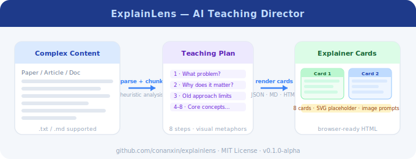

# ExplainLens

**Turn papers and complex texts into visual explainer cards and cartoon storyboards.**

中文名：图解复杂内容的 AI 教学导演

[](https://www.python.org/downloads/)
[](LICENSE)
[]()
[](https://github.com/conanxin/explainlens/actions/workflows/ci.yml)

> **当前版本**: v0.1.0-alpha (Phase 3 — Provider adapter interface)。
> **重要说明**：当前版本**不调用外部 AI API**，**不生成真实图片**。
> 系统使用启发式规则提取概念、生成 SVG 占位图和 image prompts（可后续接入 Stable Diffusion / DALL-E 等图像模型）。
> 详见 [v0.1.0-alpha Release Notes](docs/releases/v0.1.0-alpha.md)。

---

## 简介

ExplainLens 是一个开源工具，它像一位 AI 教学导演，能够：

1. 解析论文、长文、技术文档等复杂内容
2. 自动提取核心概念和关键论点
3. 生成符合人类认知顺序的教学路径
4. 为每个概念匹配生动的卡通视觉隐喻
5. 生成图片提示词（可后续接入图像生成 API）
6. 输出可视化 HTML 卡片预览

核心体验：**复杂内容 → 8 张图解卡片**

每张卡片包含：标题、简明解释、视觉隐喻、卡通画面描述、图片 prompt、takeaway、原文来源片段。

## Demo Preview



Run `outputs/sample_run/cards.html` to see 8 visual explainer cards in your browser.
See [docs/DEMO.md](docs/DEMO.md) for the full demo guide.

## Demo

See [docs/DEMO.md](docs/DEMO.md).

## 功能特性

- 📖 **文本解析** — 支持 `.txt`、`.md` 和 `.pdf`（可搜索 PDF）文件
- 📄 **PDF 输入** — Phase 2 支持搜索型 PDF，保留页码信息
- 🔪 **智能分块** — 按段落切分（txt/md）或页感知切分（PDF），保留字符偏移
- 🔍 **关键词分析** — 启发式提取核心问题、概念、方法、证据、局限
- 🎓 **教学路径** — 8 步固定教学计划
- 🎨 **卡通隐喻** — 迷宫、放大镜、侦探板、知识树等 8 种视觉隐喻
- 🖼️ **图片 Prompt** — 生成英文 prompt，适配 Stable Diffusion / DALL-E
- 📄 **多格式导出** — JSON / Markdown / HTML
- 📎 **Clickable Citations** — 每个卡片的 source 区域可点击，跳转到页面底部的 Source Appendix
- 📊 **Source Index** — `source_index.json` 记录 chunk/card/page 交叉引用
- 🔌 **Provider Interface** — 可插拔分析后端（rule-based + mock-llm），不调用外部 API
- 🧩 **SVG 占位图** — 无外部 API 依赖，纯本地运行

## 安装

```bash
git clone https://github.com/conanxin/explainlens.git
cd explainlens
python -m venv .venv
source .venv/bin/activate   # Linux / macOS
# 或 .venv\Scripts\activate  # Windows
pip install -e ".[dev]"
```

## 快速开始

```bash
# 运行示例
python -m explainlens.cli analyze \
  --input examples/sample_article.txt \
  --output outputs/sample_run

# 或用安装后的 CLI 命令
explainlens analyze \
  --input examples/sample_article.txt \
  --output outputs/sample_run
```

然后用浏览器打开 `outputs/sample_run/cards.html` 预览结果。

ExplainLens 输出 `source_index.json` 文件，并在 `cards.html` 中提供可点击的 citations，点击即可跳转到页面底部的 Source Appendix。

## 快速开始（详细版）

详见 [docs/QUICKSTART.md](docs/QUICKSTART.md)。

## PDF 输入

ExplainLens Phase 2 支持从可搜索 PDF 中提取文本：

```bash
# 生成示例 PDF
python scripts/create_sample_pdf.py

# 分析 PDF
python -m explainlens.cli analyze \
  --input examples/sample_paper.pdf \
  --output outputs/pdf_demo
```

限制：

- 不支持 OCR（扫描版 PDF 不受支持）
- 目前不深度解析表格、公式和图形
- 文本提取通过 PyMuPDF 完成，完全本地运行

## Providers

ExplainLens supports provider-based analysis via the `--provider` flag.

```bash
# Default: rule-based heuristic provider
python -m explainlens.cli analyze --input examples/sample_article.txt --output outputs/sample_run --provider rule-based

# Mock LLM: simulates future LLM output (no API calls)
python -m explainlens.cli analyze --input examples/sample_article.txt --output outputs/mock_run --provider mock-llm
```

Current providers:

| Provider | Description | External API |
|----------|-------------|--------------|
| `rule-based` | Default local heuristic provider | No |
| `mock-llm` | Local mock provider for testing the future LLM interface | No |

No external AI APIs are called in v0.1.x. See [docs/PROVIDERS.md](docs/PROVIDERS.md) for details.

## 输出文件

运行后，输出目录包含：

| 文件 | 说明 |
|------|------|
| `source_pages.json` | 每页文本和偏移（仅 PDF） |
| `source_chunks.json` | 原文分块结果 |
| `source_index.json` | 来源索引：chunk/page/card 交叉引用 |
| `concept_map.json` | 核心概念提取 |
| `teaching_plan.json` | 8 步教学计划 |
| `storyboard.json` | 卡通分镜脚本 |
| `image_prompts.json` | 图片生成提示词 |
| `cards.json` | 最终卡片数据 |
| `cards.md` | Markdown 格式卡片 |
| `cards.html` | 浏览器可预览的 HTML 卡片 |
| `run_summary.json` | 运行摘要 |

## 运行测试

```bash
pip install -e ".[dev]"
python -m pytest
```

## 项目架构

```
explainlens/
├── src/explainlens/    # 核心源码
│   ├── parser.py       # 文档解析
│   ├── chunker.py      # 文本分块
│   ├── analyzer.py     # 关键词分析
│   ├── prompts.py      # 提示词模板
│   ├── planner.py      # 教学计划生成
│   ├── storyboard.py   # 卡通分镜生成
│   ├── renderer.py     # HTML 渲染
│   ├── exporters.py    # 多格式导出
│   ├── source_index.py # 来源索引与 citation
│   ├── schemas.py      # 数据模型
│   ├── cli.py          # CLI 入口
│   └── providers/      # Provider 适配器接口
│       ├── base.py     # 抽象接口
│       ├── rule_based.py # 规则引擎 provider
│       ├── mock_llm.py # Mock LLM provider
│       └── registry.py # Provider 注册中心
├── tests/              # 测试
├── examples/           # 示例输入
├── docs/               # 文档
├── scripts/            # 工具脚本
├── .github/            # GitHub Actions CI
└── outputs/            # 输出目录（gitignore）
```

## 路线图

详见 [ROADMAP.md](docs/ROADMAP.md)：

- **Phase 1** ✅ 本地文本 → 解释卡（当前版本）
- **Phase 2** ✅ PDF 解析（searchable PDF text extraction）
- **Phase 3** 🔄 Provider 适配器接口（rule-based + mock-llm）
- **Phase 4** 真实图片生成适配器
- **Phase 5** Web UI
- **Phase 6** 长图/PPT/视频导出

## 当前限制

Phase 2 版本有以下已知限制：

- **不支持扫描版 PDF** — 无 OCR，仅支持搜索型 PDF
- **不解析表格和公式** — PDF 中的表格、图形、数学符号不深度解析
- **不调用外部 AI API** — 不使用 OpenAI / Anthropic / Ollama 等服务
- **不生成真实图片** — 输出 SVG 占位图和 image prompts，不接入 Stable Diffusion / DALL-E
- **无 Web UI** — 仅命令行工具
- **概念提取为启发式规则** — 不使用 LLM，质量取决于输入文本结构

## 常见问题

详见 [docs/FAQ.md](docs/FAQ.md)。

## 版本历史

- [CHANGELOG.md](CHANGELOG.md)
- [v0.1.0-alpha Release Notes](docs/releases/v0.1.0-alpha.md)

## 贡献

欢迎贡献！请先阅读 [CONTRIBUTING.md](docs/CONTRIBUTING.md)。

## License

MIT License — 详见 [LICENSE](LICENSE)。
